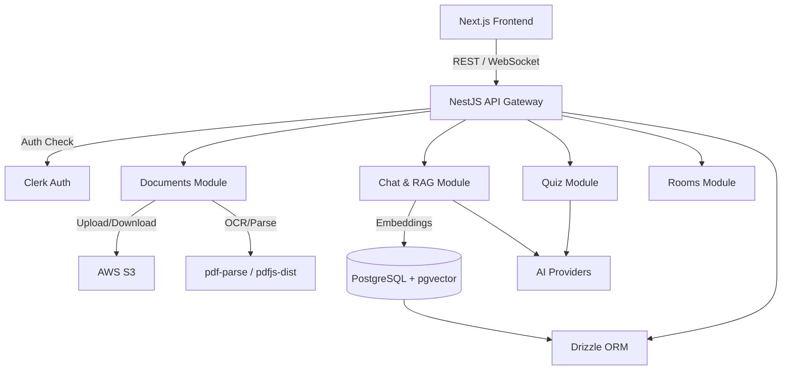

# StudyMate AI - Comprehensive Audit & Implementation Plan

## Goal Description
Perform a complete 12-phase audit of the StudyMate AI codebase, identifying architectural, security, performance, and technical debt issues without making immediate code changes. Following the audit, propose a numbered implementation plan for approval.

---

## PHASE 1 — PROJECT UNDERSTANDING (Architecture Overview)

### Overview
StudyMate AI is a full-stack TypeScript monorepo managed via Turborepo and pnpm. It empowers users to upload study materials (PDFs), extract text/OCR, generate embeddings, and engage in AI-powered chat and quiz generation.

### Technology Stack
- **Frontend Framework**: Next.js 15 (App Router)
- **Backend Framework**: NestJS 11
- **Database**: PostgreSQL with `pgvector`
- **Authentication**: Clerk
- **Storage**: AWS S3
- **AI Integrations**: Gemini, OpenRouter, NVIDIA (via standard SDKs)
- **Package Manager**: pnpm
- **Build Tools**: Turborepo, Vite (for tests), tsc
- **State Management**: React Context, SWR (client caching)
- **Realtime**: Socket.IO

### High-Level Architecture

---

## PHASE 2 & 4 — BACKEND AUDIT

### Core Modules
1. **Documents Module**
   - **Purpose**: PDF upload, parsing, text extraction, semantic chunking, embedding generation.
   - **Working**: Uploads to S3, basic extraction.
   - **Issues**:
     - *Fragility*: Uses `for` loops to process pages sequentially (memory/timeout risk).
     - *Error Handling*: Swallows OCR errors; weak typing (`any` in canvas factory).
   - **Risk**: High (Memory exhaustion on large PDFs).

2. **Chat / RAG Module**
   - **Purpose**: Semantic search and LLM interaction.
   - **Working**: Vector similarity search using pgvector.
   - **Issues**:
     - *Security (Data Leak)*: Vector searches lack strict User ID scoping in some code paths. If a user queries without specifying a `documentId`, it might search across all chunks.
     - *Performance*: RRF (Reciprocal Rank Fusion) logic is currently split between JS and SQL, which is slow for large datasets.
   - **Risk**: Critical (Security).

3. **Quiz Module**
   - **Purpose**: AI-based quiz generation.
   - **Issues**:
     - *Typing*: Unsafe `any` casts leading to lint errors.
     - *Resilience*: Weak retry parsing logic if AI returns malformed JSON.

4. **Webhooks Module**
   - **Purpose**: Sync Clerk users.
   - **Issues**:
     - *Memory Leak*: Uses a raw JS `Set` or `Map` to track processed webhook IDs. Over time, this will grow unbounded and crash the Node process.

5. **Rooms Module (WebSockets)**
   - **Purpose**: Real-time study sessions.
   - **Issues**:
     - *Scalability*: Relies on default in-memory Socket.IO adapter. Cannot scale horizontally without Redis.

---

## PHASE 3 — FRONTEND AUDIT

- **UI/UX**: Uses Tailwind CSS v4. Clean structure but lacks proper markdown rendering in chat (raw text is displayed).
- **State Updates**: Aborting a chat stream in the UI does not safely disconnect the backend generation, leading to fragmented history.
- **Error Handling**: Needs better boundaries for failed document uploads.
- **Code Duplication**: Fetching logic is somewhat duplicated across components; could consolidate custom hooks.

---

## PHASE 5 — DATABASE AUDIT

- **Schema**: Managed by Drizzle ORM (`packages/db`).
- **Junction Tables**: Currently, `conversations` and `quizzes` use `jsonb` arrays to store `documentIds`.
  - *Risk*: This prevents proper foreign key constraints. If a document is deleted, the ID remains orphaned in the JSON array, breaking the app later. Requires proper junction tables (e.g., `conversation_documents`).

---

## PHASE 6 — SECURITY AUDIT

- **Authentication**: Clerk integration is solid.
- **Data Isolation**: As mentioned, the RAG query needs strict scoping to `userId` to prevent cross-tenant data leaks.
- **Rate Limiting**: Currently missing global rate limiting (no ThrottlerGuard enabled globally), exposing the API to DoS and expensive LLM token abuse.
- **Docker**: Backend container runs as `root`, which is a security risk.

---

## PHASE 7-11 — PERFORMANCE, REALTIME, QUALITY, AI

- **Performance**: Missing caching (`LRUCache`) for high-frequency operations. No job queue (BullMQ) means document processing blocks the main event loop.
- **Code Quality**: 39+ TypeScript strict linting errors (mostly `any` types and floating promises).
- **AI Integration**: Good fallback mechanism (`executeWithFallback`), but prompt constraints can be stricter.
- **Testing**: Excellent basic unit tests (Vitest) and e2e setup, but failing lint checks break the CI pipeline.

---

## PHASE 12 — FINAL REPORT

### Executive Summary
StudyMate AI is a well-structured modern application. However, it suffers from a critical security flaw (RAG data scoping), a memory leak (Webhook tracking), architectural limitations (synchronous PDF processing, JSONB foreign keys), and unresolved technical debt (lint errors, lack of API docs).

### Scores
- **Maintainability**: 6/10
- **Security**: 4/10
- **Performance**: 5/10
- **Scalability**: 4/10
- **User Experience**: 7/10
- **Code Quality**: 6/10
- **Overall**: 5.5/10

---

## User Review Required
> [!IMPORTANT]
> The proposed plan requires adding new dependencies to properly resolve the architectural flaws. 
> 1. `bullmq` and `redis` (For background document processing).
> 2. `@nestjs/platform-socket.io` and `redis` (For horizontally scaling WebSockets).
> 3. `react-markdown` (For frontend UI).
> 4. `@nestjs/throttler` (For rate limiting).
> 5. `lru-cache` (To fix the webhook memory leak).
>
> Please confirm if I am approved to install these dependencies and proceed with the implementation plan below.

---

## IMPLEMENTATION PLAN (Proposed Changes)

### Phase 1: Immediate Security & Stability
1. **RAG Data Leak**: Update `rag.service.ts` to strictly enforce `userId` in `inArray` filters.
2. **Rate Limiting**: Apply `@nestjs/throttler` globally in `app.module.ts`.
3. **Webhook Memory Leak**: Replace the JS `Set` in `webhooks.controller.ts` with `lru-cache`.
4. **Docker Security**: Add `USER node` to `Dockerfile.backend`.

### Phase 2: Database & State
5. **Junction Tables**: Refactor `packages/db` schemas to remove `jsonb` document arrays and replace them with `conversation_documents` and `quiz_documents` junction tables. Generate and run Drizzle migrations.
6. **Chat Abort**: Fix frontend/backend chat history persistence so aborted streams save cleanly.

### Phase 3: Architecture & Scalability
7. **Document Queue**: Implement `BullMQ` for async PDF processing, replacing the `for` loop in `documents.service.ts`.
8. **Redis WebSockets**: Implement `RedisIoAdapter` in `main.ts` for scalable realtime study rooms.
9. **Frontend UX**: Add `react-markdown` to safely render AI responses.

### Phase 4: Technical Debt & DX
10. **Linting**: Resolve all TypeScript strict errors across the codebase.
11. **Swagger**: Implement `@nestjs/swagger` for backend API documentation.

## Verification Plan
- **Automated**: Run `pnpm lint`, `pnpm typecheck`, and `pnpm test`.
- **Manual**: Verify PDF upload processes in the background, chat returns correct context without leaking other users' data, and Swagger UI loads successfully at `/api/docs`.
